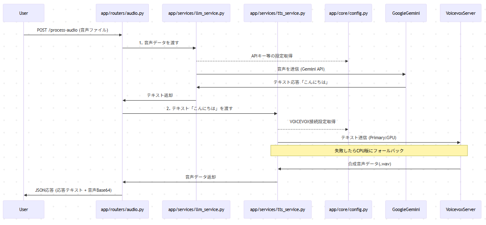

# 内部設計書 (Internal Design)

## アーキテクチャ概要

本プロジェクトは **FastAPI** をベースにしており、保守性と拡張性を高めるために **Service Layer パターン** を採用しています。
責務を明確に分離することで、将来の機能追加やLLM/TTSエンジンの変更に対応しやすくしています。

### ディレクトリ構成

```
app/
├── core/       # 設定・定数管理
├── routers/    # APIエンドポイント定義 (Controller層)
├── services/   # ビジネスロジック・外部連携 (Service層)
└── main.py     # アプリケーションエントリーポイント
```

## モジュール詳細

### 1. Core (`app/core/`)

アプリケーション全体の設定を管理します。

- **`config.py`**:
    - 環境変数 (`.env`) の読み込み。
    - Gemini APIキー、VOICEVOXのホスト情報、モデル設定、システムプロンプトなどを `Settings` クラスで一元管理します。

### 2. Services (`app/services/`)

外部サービスとの連携ロジックをカプセル化します。

- **`LLMService` (`llm_service.py`)**:
    - **役割**: Gemini API との通信。
    - **特徴**: 音声データを直接 Gemini に送信するマルチモーダル入力を使用。STT (Speech-to-Text) を個別の処理として持たず、Gemini 内で音声理解を行わせることでレイテンシを削減しています。
    - **モデル**: `gemini-2.5-flash-lite` (設定で変更可能)

- **`TTSService` (`tts_service.py`)**:
    - **役割**: VOICEVOX Engine との通信。
    - **フォールバック機能**:
        1.  **Primary Host**: 高速な生成を期待して、まずは GPU 搭載機などのメインサーバーへリクエストします (Timeout: 0.5s)。
        2.  **Secondary Host**: メインサーバーが応答しない、またはエラーの場合、ローカル (CPU) などのセカンダリサーバーへリクエストします。
    - この仕組みにより、外部サーバーダウン時でもサービスの継続性を担保しています。

### 3. Routers (`app/routers/`)

HTTP リクエストのハンドリングを行います。

- **`audio.py`**:
    - `POST /process-audio` エンドポイントを提供。
    - `Depends` を使用して `LLMService`, `TTSService` を注入。
    - 処理フロー:
        1.  受信した音声ファイルを読み込む。
        2.  `LLMService` で応答テキスト生成。
        3.  `TTSService` で音声合成。
        4.  結果を JSON で返却 (音声は base64 エンコード)。
    - 各ステップの処理時間をログ出力し、パフォーマンス監視を容易にしています。

## 処理フロー (Sequence)

ユーザーが音声を送信してから応答が返るまでの流れは以下の通りです。

1.  **User** -> `POST /process-audio` (Audio File) -> **Server**
2.  **Server** -> Gemini API (Audio + Prompt) -> **Text**
    - *Prompt*: "この発言に応答してください。" + System Instruction
3.  **Server** -> VOICEVOX Primary (Text) -> **Audio (WAV)**
    - *Fail* -> VOICEVOX Secondary (Text) -> **Audio (WAV)**
4.  **Server** -> Response JSON (Text + Audio Base64) -> **User**

## エラーハンドリング

- **LLM エラー**: Gemini との通信に失敗した場合、デフォルトのエラーメッセージ ("エラーが発生しました。") を返し、クライアントアプリがクラッシュしないようにしています。
- **TTS エラー**: 音声合成に失敗した場合 `audio_base64` は `null` となり、クライアント側でテキストのみの表示などで対応可能です。


